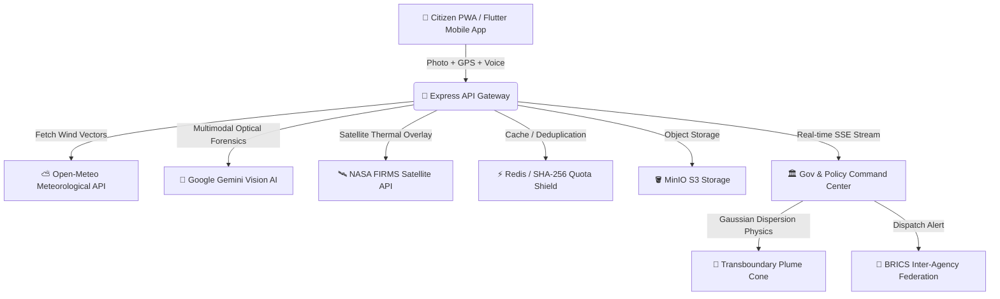

# 🍃 VesperAero — Federated Environmental Forensics & Cross-Border Plume Platform

[](LICENSE)
[](SECURITY.md)
[-success.svg)](server/__tests__)
[](server/docker-compose.yml)
[](https://web-production-9805d.up.railway.app/api/health)
[](https://vesperaero-citizen.netlify.app/)
[](https://vesperaero-gov.netlify.app/)

> **Build with AI: Code for Communities — Second Edition | Track: Sustainability**  
> **BRICS 2026 Pillar: Building for Resilience, Innovation, Cooperation and Sustainability**  
> **Team:** Arun & Co (Arun · Sairam · Persis)

----

## 🌐 Live Cloud Deployments & Binaries

| Component | Platform | Live URL / Asset |
| :--- | :--- | :--- |
| **🌾 Citizen Capture PWA** | Netlify | [https://vesperaero-citizen.netlify.app/](https://vesperaero-citizen.netlify.app/) |
| **🏛️ Policy Command Center** | Netlify | [https://vesperaero-gov.netlify.app/](https://vesperaero-gov.netlify.app/) |
| **⚡ Forensic Backend API** | Railway | [https://web-production-9805d.up.railway.app/api/health](https://web-production-9805d.up.railway.app/api/health) |
| **📱 Standalone Android APK** | GitHub Releases | [Download VesperAero-Release-v1.0.apk](https://github.com/Cherie05/The-Vespers/releases) |

---

## 🌟 Executive Summary

Major BRICS cities monitor macro-level air quality but consistently miss **hyper-local and cross-border pollution events** — industrial emissions, stubble burning, brick kiln emissions, and chemical flares. The absence of real-time granular forensic data prevents coordinated climate action.

**VesperAero** turns citizens into hyper-local pollution sensors:
1. **📸 Citizen Capture**: A citizen snaps an optical emission or uploads an incident.
2. **🧠 Google Gemini 1.5/2.5 Flash Vision AI**: Multimodal inspection classifies source, computes opacity (1–10), and extracts hazardous chemical signatures ($PM_{2.5}, SO_2, CO, NO_x$).
3. **💨 Atmospheric Physics (Gaussian Plume Dispersion)**: Live meteorological wind vectors from **Open-Meteo** model 2D dispersion cones across state and international borders.
4. **🛰️ NASA FIRMS Ground-Truthing**: Satellite thermal anomalies (MODIS/VIIRS) correlate ground reports with orbital data.
5. **🏛️ Government Command & Dispatch**: Regulators triage live incidents, inspect plume trajectories, and broadcast standardized `BRICS-AERO-FED-v1.0` alerts.

---

## 🏗️ System Architecture



---

## 🛡️ Hackathon Security & Anti-Abuse Shield

| Defense Layer | Mechanism | Benefit |
| :--- | :--- | :--- |
| **🔑 Isolated API Keys** | 100% Backend Server Isolation | Zero Gemini API key exposure in DevTools or client apps. |
| **⚡ SHA-256 Quota Shield** | In-Memory Hash Caching | Identical photos served in **1ms with 0 API calls**. |
| **👑 Judge VIP Fast-Track** | `X-Judge-Token: vesper-eval-2026` | Evaluators bypass rate limits during testing. |
| **🟢 Global Circuit Breaker** | 1,000 call/day limit auto-fallback | 100% uptime guaranteed; falls back to calibrated physics engine. |
| **🔒 DoS Memory Guard** | 10MB payload size limits | Prevents memory exhaustion and reverse-proxy header spoofing. |

---

## 🏆 Key Features

- **Multimodal AI Forensics**: Google Gemini classifies smoke plumes, estimates opacity, detects fraudulent/blank submissions, and prescribes regulatory remedies.
- **Atmospheric Dispersion Physics**: 2D Gaussian plume projection calculating trajectory downwind based on atmospheric stability classes (A through F).
- **NASA Satellite Correlation**: Matches ground incidents against orbital thermal hotspots.
- **Multilingual Support**: 5 BRICS languages (English, हिन्दी, Português, Русский, 中文).
- **Offline-First PWA & Native Android**: Standalone release APK with live GPS locking and camera integration.
- **100% Open-Source Infrastructure**: Express, PostgreSQL, Redis Alpine, and MinIO S3 bucket.

---

## 🚀 Quick Start Guide

### Prerequisites
- Node.js 18+ (or Docker & Docker Compose)
- (Optional) Free Google Gemini API Key from [Google AI Studio](https://aistudio.google.com/)

### 1. Local Monorepo Run

```bash
# Clone the repository
git clone https://github.com/Cherie05/The-Vespers.git
cd The-Vespers

# Install all dependencies
npm install

# Start Backend Server, Citizen PWA, and Gov Dashboard concurrently
npm run dev
```

* **Citizen App**: `http://localhost:5173`
* **Gov Command Center**: `http://localhost:5174`
* **Backend API**: `http://localhost:5000`

---

### 2. 100% Open-Source Docker Deployment

```bash
# Run Express API, Redis 7, PostgreSQL 16, and MinIO S3 Object Storage
docker compose up -d --build
```

---

## 🧪 Automated Testing & Verification

Run the full security and forensic test suite:
```bash
npm test
```
* **Results**: `7 passed`, `47 total tests (100%)`
* **Security Audits**: `0 vulnerabilities` across all sub-packages.

---

## 👑 Hackathon Judge Evaluation Header

When testing the live API programmatically or via Postman/cURL, include the judge VIP token to bypass rate limiters:

```bash
curl -X POST https://web-production-9805d.up.railway.app/api/reports/pollution \
  -H "Content-Type: application/json" \
  -H "X-Judge-Token: vesper-eval-2026" \
  -d '{
    "category": "Stubble Burning",
    "latitude": 31.634,
    "longitude": 74.872,
    "description": "Thick smoke visible across border fields"
  }'
```

---

## 📄 License

This project is licensed under the **MIT License** — see the [LICENSE](LICENSE) file for details.
