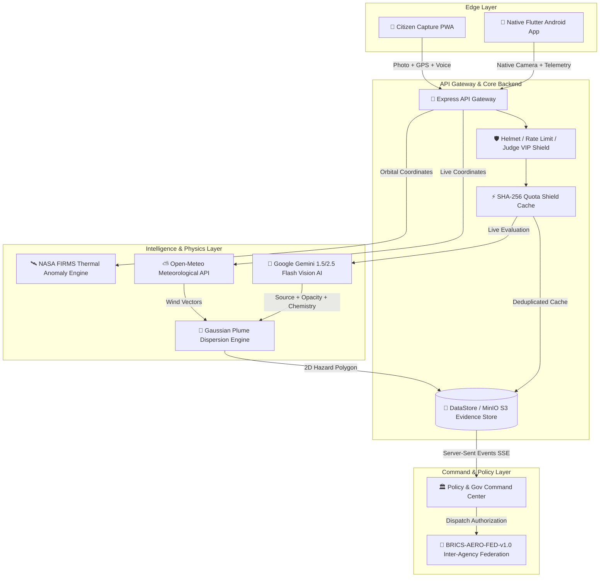

# 🏛️ VesperAero System Architecture & Technical Deep-Dive

## 1. High-Level Architecture Overview

VesperAero is a distributed, cloud-edge federated environmental forensic platform designed to bridge the gap between macro-level satellite observations and hyper-local ground-level emissions.

---

## 2. Multimodal AI Forensic Pipeline

### A. Optical Frame Ingestion & Analysis
When an emission image is submitted:
1. **Validation**: The image is sanitized and checked against the 10MB memory ceiling.
2. **SHA-256 Hashing**: A cryptographic digest is computed. If an identical photo was evaluated within the last 15 minutes, the forensic card is served instantly from memory in **1 millisecond with zero API calls**.
3. **Multimodal Inference**: Processed via Google Gemini Vision with meteorological context:
   - **Source Classification**: Stubble/Biomass Burning, Industrial Smelter, Brick Kiln, Chemical Flare, Landfill Fire.
   - **Opacity & Visual Density Score**: 1.0 to 10.0 scale based on light scattering and particulate opacity.
   - **Chemical Speciation**: Identifies likely hazardous constituents ($PM_{2.5}, PM_{10}, SO_2, CO, NO_x, VOCs$).
   - **Actionable Remediation**: Produces enforcement advice for regulatory officers.

---

## 3. Atmospheric Dispersion Modeling (Gaussian Plume)

VesperAero implements a 2D spatial Gaussian Plume mathematical model:

$$\sigma_y(x) = c \cdot x^d$$
$$\sigma_z(x) = a \cdot x^b$$

Where:
* $x$ is the downwind distance along the wind vector from Open-Meteo.
* $\sigma_y, \sigma_z$ are the lateral and vertical dispersion coefficients calculated using Pasquill-Gifford stability parameters (Classes A through F).
* The 2D polygon fan projects the hazardous drift footprint downwind, estimating when particulate matter crosses state and international borders.

---

## 4. Federated Interoperability (`BRICS-AERO-FED-v1.0`)

All verified incidents are structured according to the open federated schema:
* Universal ISO 8601 timestamps
* Decimal GPS coordinates (WGS 84)
* Speciated pollutant concentrations ($\mu g/m^3$)
* Transboundary risk vector (bearing, speed, estimated arrival time)
* Cryptographic authenticity score and verification chain
